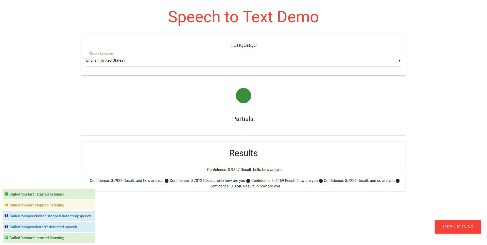

# Web Speech API Demo

The Web Speech API has two parts: `SpeechSynthesis` (Text-to-Speech - TTS) and `SpeechRecognition` (Speech-to-Text - STT).
**This demo only explores the STT part.**

Read more about this [here](./web_speech_api.md)

## Run demo
In the root directory run the command:
```javascript
$ python -m SimpleHTTPServer 3000
```
Open [Chrome](https://www.google.com/chrome/browser/desktop/index.html) or [Chromium](https://chromium.woolyss.com/) browser at [http://localhost:3000](http://localhost:3000) (currently browsers that supports this API)

## Screenshot



### Note
Try saying `play Daft Punk Get Lucky`. You can also try other artists and tracks just say `play` before it.
